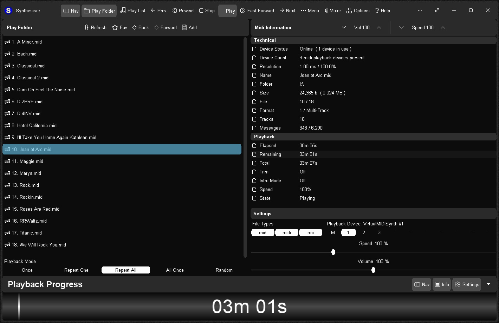
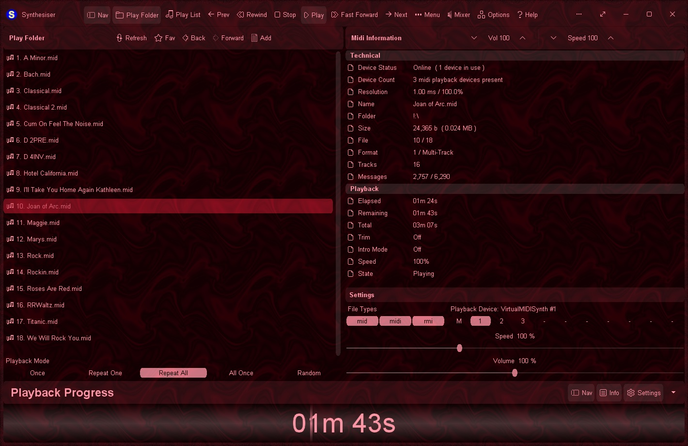
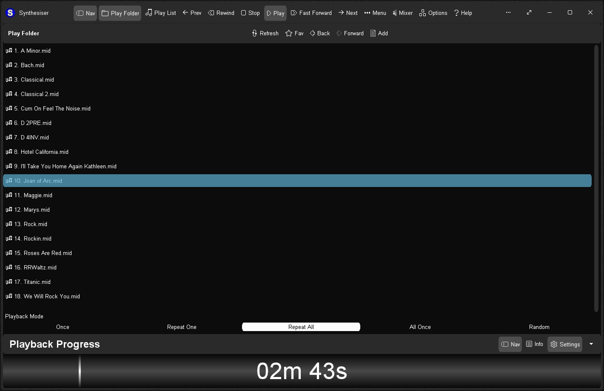

# Synthesiser v2.0.158 / 09nov2025 / MIT License
Easy to use midi player - play midi files with the ".mid", ".midi" and ".rmi" file extension.

# Features
* Dual play systems - Play Folder and Play List
* Comes with 18 built-in sample midis on a virtual disk
* Elapsed, Remaining and Total time readouts
* Device Status and Device Count readouts
* Native ".m3u" playlist support (copy, paste, open, save, build)
* Drag and drop midi files to play/add to playlist
* Play Modes: Once, Repeat One, Repeat All, All Once, Random
* Play Speed: 50% to 200% (0.5x to 2x)
* Intro Mode: Play first 2s, 5s, 10s or 30s of midi
* Rewind/Fast Forward by: 1s, 2s, 5s, 10s or 30s
* Play on Start option - playback commences on app start
* Always on Midi option - maintain connection to midi device for instant playback
* Auto Fade In - eliminate loud or abrupt notes during rewind, fast forward or reposition operations
* Playback Progress bar - click to reposition/jump backward or forward in time
* Volume control with volume boost (up to 200%)
* "Mixer" link - display Windows "Volume Mixer" app
* Play ".mid", ".midi" and ".rmi" midi files in 0 and 1 formats
* Scrolling lyrics viewer
* Detailed midi information panel
* Large list capacity for handling thousands of midi files
* Switch between up to 10 midi playback devices
* Custom built midi playback engine for high playback stability
* Automatic compact mode for display on small/low resolution screens
* Simple and easy to use
* Options Window - Easily change app color, font, and settings
* Portable
* Smart Source Code (Borland Delphi 3 and Lazarus 2)

# Download
Download <a href="src/synthesiser.exe">synthesiser.exe</a> or from the "<a href="bin/">bin</a>" or "<a href="src/">src</a>" folders above.

# Images

